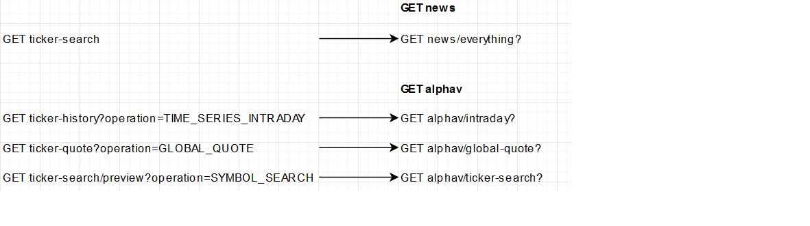

<p align="center">
  <a href="http://nestjs.com/" target="blank"></a>
</p>

## Description
Equest Explorer backend
Allows search of stock news from the following integrations
- News API
- Alpha Vantage
- Marketaux
- more to come...
  
## Documentation
- Available via Swagger (OpenAPI) => run locally and proceed to `http://localhost:3001/api`


## Prerequisites
`.env file` in root directory
- API keys procured from their respective websites
- MONGODB URI for news record keeping

```
NODE_ENV="local"
INTEGRATIONS_ENABLED=true

NEWS_API_KEY=
ALPHAV_API_KEY=
MARKETAUX_API_KEY=
MONGODB_URI=
```

#### Equest-endpoint-migration

[Nest](https://github.com/nestjs/nest) framework TypeScript starter repository.

## Installation

```bash
$ npm install
```

## Running the app

```bash
# development
$ npm run start

# watch mode
$ npm run start:dev

# production mode
$ npm run start:prod
```

## Test

```bash
# unit tests
$ npm run test

# e2e tests
$ npm run test:e2e

# test coverage
$ npm run test:cov
```

## Support

Nest is an MIT-licensed open source project. It can grow thanks to the sponsors and support by the amazing backers. If you'd like to join them, please [read more here](https://docs.nestjs.com/support).

## Stay in touch

- Author - [Kamil Myśliwiec](https://kamilmysliwiec.com)
- Website - [https://nestjs.com](https://nestjs.com/)
- Twitter - [@nestframework](https://twitter.com/nestframework)

## License

Nest is [MIT licensed](LICENSE).
